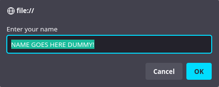
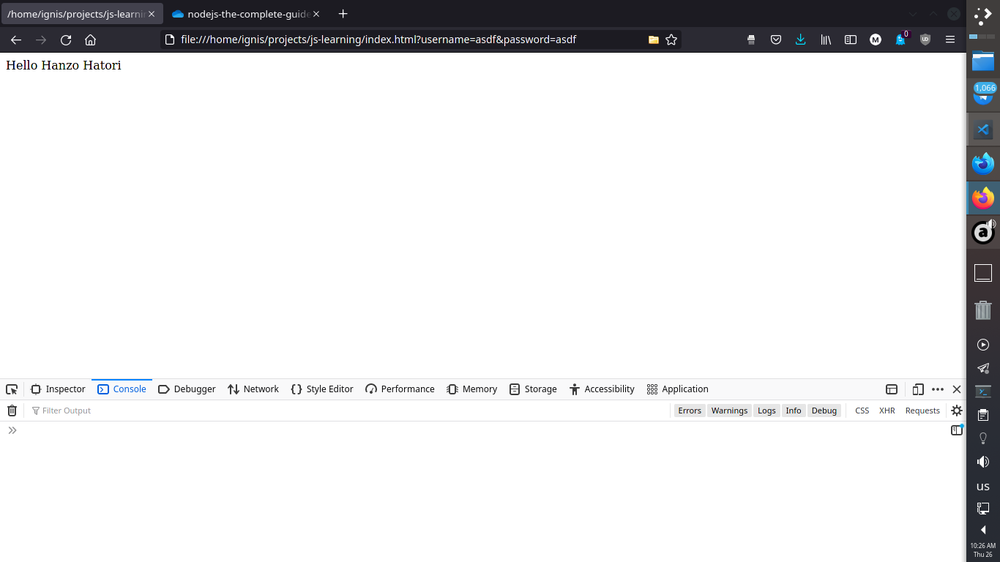

# Prompt Box

### Prompt Box is used to take user input, then you can use it however you see fit

```javascript
let name=prompt("Enter your name", "NAME GOES HERE... PUNK!");
document.write("Hello " + name);
```
* The prompt takes two arguments:
    * Thefirst argument in the prompt is the text that appears above the input area
    * The second argument appears inside the input area

    

### Then The output is displayed on the page, let's say that my name is Hanzo Hatori
### My name will appear on the page when I type it:




