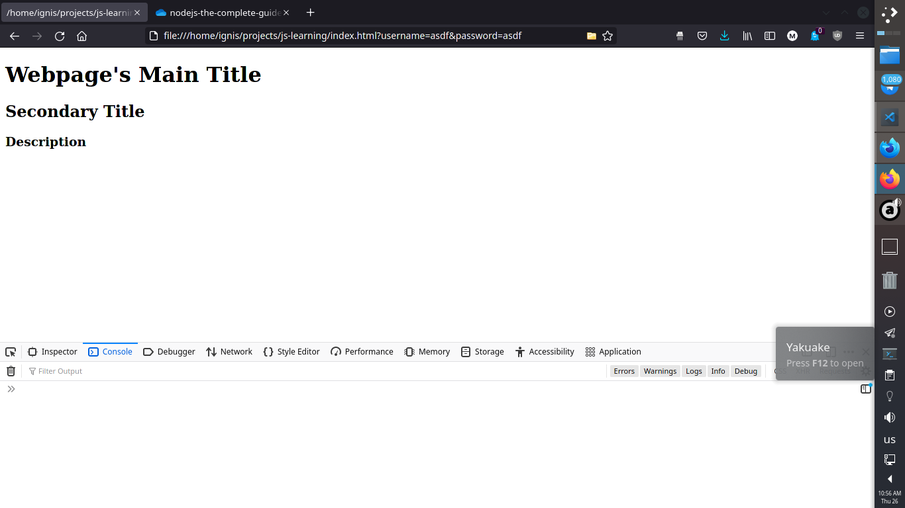
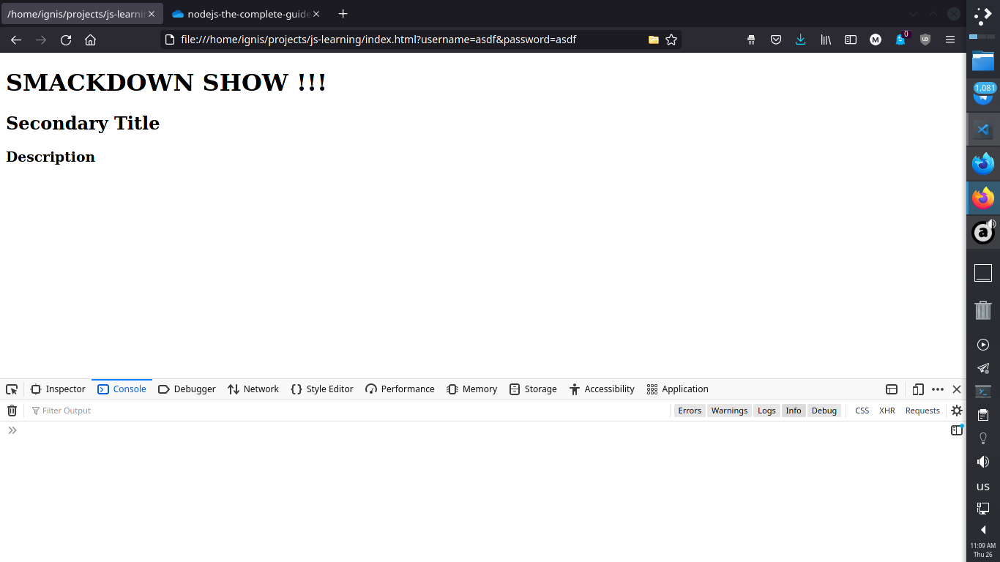
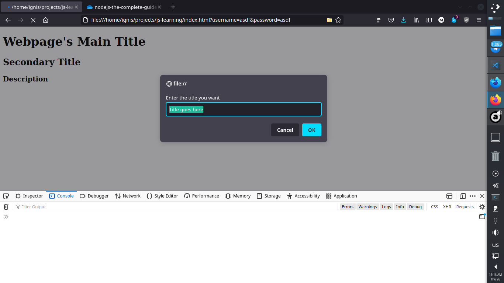
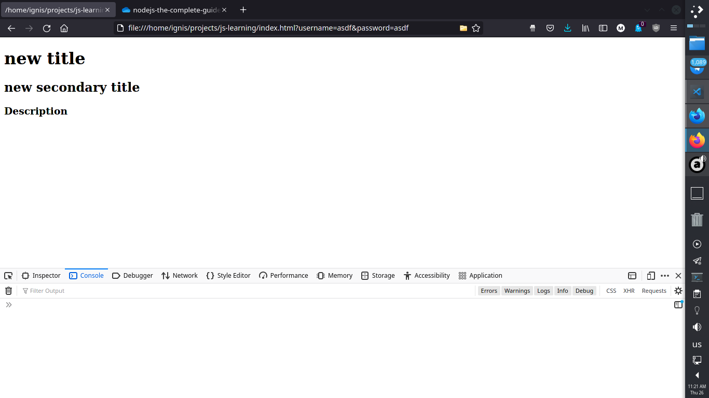

# Get HTML Element By ID

### It's useful when you want to edit a webpage to be able to edit specific lines of text according to your needs

### Let's take this HTML file for example

```html
<!doctype html>
<html>
<head>

<meta content="text/html;charset=utf-8" http-equiv="Content-Type">
<meta content="utf-8" http-equiv="encoding">

</head>

<body>

  <h1 id="title">Webpage's Main Title</h1>  
  <h2 id="s-title">Secondary Title</h2></h1> 
  <h3 id="desc">Description</h3> 
<script src="./utils.js"></script>
<script src="./scripto.js"></script>

</body>


</html>
```
### We specified an ID for each tag of text, but we didn't manipulate the text yet
### This page will display the three sentences according to the font size we specified




```javascript
document.getElementById('title').innerHTML= "SMACKDOWN SHOW !!!";
```

### The title we had will change to what we specified



### We can also add a variable and change the HTML with it


```javascript
let smack_title = "SMACKDOWN SHOW !!!"
document.getElementById('title').innerHTML = smack_title;
```

### We can use this information to let the user change the content of the page according to their input like we learned from the [previous lesson](./09-prompt-box.md) when we used the prompt box to take the user input.

#### Remember, the prompt function takes two arguments separated by a comma

```javascript
let smack_title = prompt("Enter the new title please","Title goes here...");
document.getElementById('title').innerHTML = smack_title;
```

### The page will ask you to enter the new title




### And the title changes


### Of course, you can change the id to match what you want to change in your HTML webpage. Let's say I want to change the other title too

```javascript

let smack_title = prompt("Enter the new title please","Title goes here...");
let sec_title = prompt("Enter the new secondary title please","Secondary title goes here...");

document.getElementById('title').innerHTML = smack_title;
document.getElementById('s-title').innerHTML = smack_title;

```
### Both titles are going to change according to my input




### We're now interacting with the webpage with the tools we learned so far ^_^


[Previous Lesson<](./js-tutorials/09-prompt-box.md)`___________________________________________________________________________________`[>Next Lesson](./js-tutorials/11-math.md)