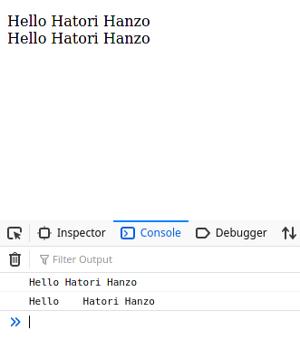

# String Manipulation

### In this lesson we're going to learn the various processes that can be done on strings.


## 1. String Interpolation:
### Using backticks `` on string variables gives you the ability to do Interpolation on strings.
### String interpolation is the ability to put placeholders and replacing them with values in a string literal.

```javascript
let personName = 'Hatori Hanzo';
let salutation = `Hello ${personName}`;
let salutation_space = `Hello    ${personName}`;
document.write("<br>"+salutation);
console.log(salutation);
document.write("<br>"+salutation_space);
console.log(salutation_space);
```



### You can see that the `salutation_space` variable did not show the extra spaces on the page but only in the console, that's because we used backticks `.  


## 2. Addition:

### You can also use addition on strings, which will only result in combining the strings together in one string. Sadly though, you can't use substraction to delete strings.

```javascript
let salutation = `Hello `;
salutation = salutation + `People`;
console.log(salutation);
```


## 3. Access String properties:
### We use the dot notation to access string properties.
#### Length, for example, can return the number of letters in a given string.

```javascript
let salutation = `Hello`;
salutation = salutation.length;
console.log(salutation); //Must return 5
```

## Examples on strings and numbers
### You can convert a number to a string to perform string manipulation processes using the special method `toString()`. Methods are also accessed using the dot notation.

```javascript
//number to string
let amount = 123, type=`people`;
amount = amount.toString();
let phrase = amount + ' of ' + type
console.log(phrase);
```

### You can also convert a string that contains a number to a number too.
```javascript
//string to number
let amount2 = `123.12`;
amount2 = Number.parseFloat(amount2);
console.log(amount2);
```


## Example on string manipulating methods
### Methods are special type of functions that are stored in the string object or any other object as a property, which can also be accessed using the dot notation.

```javascript
let salutation = `Hello `;

salutation = salutation.toLowerCase(); //Converts characters to lower case
console.log(salutation);

salutation = salutation.substring(2); //Subtracts the first number of characters you specify 
console.log(salutation);

salutation = salutation.toUpperCase(); //Converts characters to upper case
console.log(salutation);

salutation = salutation.toLocaleLowerCase(); //takes difference in locales (languages) into account
console.log(salutation);
```

### Here's a table summary of the string methods you can use

|Method|Description|
|------|-----------|
|charAt()| 	Returns the character at the specified index (position)|
|charCodeAt()| 	Returns the Unicode of the character at the specified index|
|concat()| 	Joins two or more strings, and returns a new joined strings|
|endsWith()| 	Checks whether a string ends with specified string/characters|
|fromCharCode()| 	Converts Unicode values to characters|
|includes()| 	Checks whether a string contains the specified string/characters|
|indexOf()| 	Returns the position of the first found occurrence of a specified value in a string|
|lastIndexOf()| 	Returns the position of the last found occurrence of a specified value in a string|
|localeCompare()| 	Compares two strings in the current locale|
|match()| 	Searches a string for a match against a regular expression, and returns the matches|
|repeat()| 	Returns a new string with a specified number of copies of an existing string|
|replace()| 	Searches a string for a specified value, or a regular expression, and returns a new string where the specified values are replaced|
|search()| 	Searches a string for a specified value, or regular expression, and returns the position of the match|
|slice()| 	Extracts a part of a string and returns a new string|
|split()| 	Splits a string into an array of substrings|
|startsWith()| 	Checks whether a string begins with specified characters|
|substr()| 	Extracts the characters from a string, beginning at a specified start position, and through the specified number of character|
|substring()| 	Extracts the characters from a string, between two specified indices|
|toLocaleLowerCase()| 	Converts a string to lowercase letters, according to the host's locale|
|toLocaleUpperCase()| 	Converts a string to uppercase letters, according to the host's locale|
|toLowerCase()| 	Converts a string to lowercase letters|
|toString()| 	Returns the value of a String object|
|toUpperCase()| 	Converts a string to uppercase letters|
|trim()| 	Removes whitespace from both ends of a string|
|valueOf()| 	Returns the primitive value of a String object|


[For more reading](https://dmitripavlutin.com/string-interpolation-in-javascript/#4-best-practices) 

[Previous Lesson<](11-math.md)`___________________________________________________________________________________`[>Next Lesson](13-functions.md)